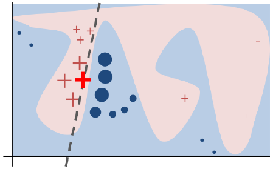
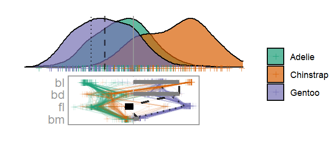

<!-- #Example vignette: 
https://github.com/njtierney/naniar/blob/master/vignettes/getting-started-w-naniar.Rmd -->
```{r setup, include = FALSE}
knitr::opts_chunk$set(
  echo       = TRUE,   # code
  include    = TRUE,   # plots
  results    = "show", # text: "hide", "show"
  eval       = TRUE,   # chunk
  message    = FALSE,
  warning    = FALSE,
  error      = FALSE,
  collapse   = TRUE,
  comment    = "#>",
  fig.height = 4,
  fig.width  = 6,
  fig.align  = "center",
  cache      = FALSE
)
```

__TL;DR__, you can jump straight into the visuals and application with `cheem::run_app()`, but we suggest you read the introduction to get situated with the context first.


# Introduction

Non-linear models regularly result in more accurate prediction than their linear counterparts. However, the number and complexity of their terms make them more opaque to the interpretability. The our ability to understand how features (variables or predictors) influence predictions is important to a wide range of audiences. Attempts to bring interpretability to such complex models is an important aspect of eXplainable Artificial Intelligence (XAI).

_Local explanations_ are one such tool used in XAI. They attempt to approximate the feature importance in the vicinity of one instance (observation). That is to say that they give an approximation of linear terms at the position of one in-sample or out-of-sample observation.

```{r limenonlinear, echo=FALSE, fig.cap="Illustration of non-linear classification boundary. The use of local explanations approximates the feature importance in the vicinity of one instance. This allow us to understand a change in which features would result in a red plus being classified as a blue circle. From _Ribiro, M. et. all. (2017). Why should I trust you?_"}

```

If the analyst can explore how models lead to bad predictions it can suggest insight into issues of the data or suggest models that may be more robust to misclassified or extreme residuals. An analyst may want to explore the support feature contributions where the explanations makes sense or may be completely unreliable. We purpose this sort of analysis as conducted with interactive graphics in the analysis and R package titled __cheem__.


# Preprocessing

This framework is broadly applicable for any model and compatible local explaination. We will illustrate with __randomForest__::randomForest() model and the tree SHAP local explanation with __treeshap__::treeshap() (available on GitHub).

The first things we need are data and a non-linear model. Here we createa a random forest model with modest hyperparameters. This will avoid overfitting the data and help mitigate the run time of tree SHAP.

```{r}
## Download if not installed
if(!require(cheem)) install.packages("cheem", dependencies = "Suggests")
if(!require(treeshap)) devtools::install_github(
  "ModelOriented/treeshap", dependencies = "Suggests")

## Load onto session
library(cheem)
library(spinifex)
library(treeshap)

## Classification case, Penguins data
X           <- penguins_na.rm[, 1:4]
clas        <- penguins_na.rm$species
Y           <- as.integer(clas)
# Variables: Bill Length, Bill Depth, Flipper Length, Body Mass
colnames(X) <- c("bl", "bd", "fl", "bm")

## Create a random forest classifying penguin species
peng_rf_fit <-  randomForest::randomForest(
  X, Y, ntree = 125,
  mtry = ifelse(is_discrete(Y), sqrt(ncol(X)), ncol(X) / 3),
  nodesize = max(ifelse(is_discrete(Y), 1, 5), nrow(X) / 500)
)

## Treeshap object
peng_rf_tshap <- peng_rf_fit %>%
  treeshap::randomForest.unify(model) %>%
  treeshap::treeshap(x, interactions = FALSE, verbose = FALSE)$shaps
message("Note: cheem expects an [n, p] matrix or data frame of the local explanation which can quickly become computationally heavy. See the last section for more options.")
```

We have created a basic random forest model predicting the species of the penguin given four variables (continuous physical measurements). Then a tree SHAP local explanation is saved for each observation.

The prediction (yhat) of the model for each observation is also needed to conduct the cheem analysis. Then 

```{r}
## Local attribution of all observations
#### !! This is expensive for complex models/data
peng_rf_shap_df <- treeshap::treeshap()
## Extract statistics and prep for cheem consumption
this_ls <- cheem_ls(X, Y, class = clas,
                    model = rf_fit, attr_df = shap_df, verbose = FALSE)
```

Now we are done with all of the leg work, let's turn our attention towards the visuals and analysis.


# Cheem viewer

We have extracted tree SHAP, an feature importance measure in the vicinity of each observation. We need to identify an instance of interest to explore; we do so with the linked brushing available in the _global view_. Then we will vary contributions from different features to test the support an explanation in a _radial tour_


## Global view

To get more complete view lets look at approximations of the data space, attribution space, and model fits side-by-side with linked brushing with the help of __plotly__ and __crosstalk__. The model information is essentially the confusion matrix for the classification case.

```{r, out.width="100%"}
global_view(this_ls, primary_obs = 243, comparison_obs = 169,
            height_px = 240, width_px = 720, as_ggplot = TRUE)
```

From this _global view_ we want to identify a primary instance (PI) and optionally a comparison instance (CI) to explore. Misclassified or observations with high residuals are good targets for further exploration. One point sticks out in this case. Instance 243 (shown as *) is a Gentoo (purple) penguin, while the model predict it to be a Chinstrap penguin. Peguin 169 (shown as x) is reasonably close by and correctly predicted as Gentoo. In practice we used linked brushing and misclassification information to guide our search.


## Radial tour

There is a lot to unpack here. The normalized distribution of all feature attribution from all instances are shown as parallel coordinates lines. The above selected PI and CI are shown here as a dashed and dotted line respectively. The first thing we notice is that the attribution of the PI is close to it's (incorrect) prediction of Chinstrap (orange) in terms of bill length (`bl`) and flipper length (`fl`). In terms of bill depth and body mass (`bd` and `bm`) it is more like its observed species Gentoo (purple). We select flipper length as the feature to manipulate.

```{r, out.width="100%", eval = FALSE}
## Normalized attribution basis of the PI
bas <- basis_attr_df(shap_df, rownum = 243)
## Default to feature to manipulation; 
#### the feature with largest separation between PI and CI attribution
mv  <- manip_var_of_attr_df(shap_df, primary_obs = 243, comparison_obs = 169)
## Make the radial tour
ggt <- radial_cheem_tour(
  this_ls, basis = bas, manip_var = mv,
  primary_obs = 243, comparison_obs = 169, angle = .25)

## Animate it
animate_gganimate(ggt, fps = 6) 
  #height = 2, width = 4.5, units = "in", res = 150
## Or as a plotly html widget
#animate_plotly(ggt, fps = 6)
```
```{r, echo=FALSE, out.width="100%"}
if(FALSE){ ## To mitigate file size (CRAN note) create a gif and include that
  bas <- basis_attr_df(shap_df, rownum = 243)
  mv  <- manip_var_of_attr_df(shap_df, primary_obs = 243, comparison_obs = 169)
  ggt <- radial_cheem_tour(
    this_ls, basis = bas, manip_var = mv,
    primary_obs = 243, comparison_obs = 169, angle = .25)
  
  #### .gif is about .2 Mb saved, while HTML widget was about 7 Mb.
  anim <- animate_gganimate(ggt, fps = 6,
                            height = 2, width = 4.5, units = "in", res = 150)
  gganimate::anim_save("tour_penguins.gif", animation = anim)#, path = "./vignettes")
  beepr::beep()
}
#
```


Starting from the attribution projection, this instance already looks more like its observed Gentoo than predicted Chinstrap. However, by frame 8, the basis has a full contribution of flipper length and does look more like the predicted Chinstrap. Looking at the parallel coordinate lines on the basis visual we can see that flipper length has a large gap between PI and CI, lets check the original variables to digest.

```{r}
library(ggplot2)

ggplot(penguins_na.rm, aes(x = bill_length_mm,
                           y = flipper_length_mm,
                           colour = species,
                           shape = species)) +
  geom_point() +
  ## Highlight PI, *
  geom_point(data = penguins_na.rm[243, ], shape = 8, size = 5, alpha = 0.8) +
  ## Theme, scaling, color, and labels
  theme_bw() +
  theme(aspect.ratio = 1) +
  scale_color_brewer(palette = "Dark2") +
  labs(y = "Flipper length [mm]", x = "Bill length [mm]", 
       color = "Observed species", shape = "Observed species")
```

This profile, with two features that are most distinguished between the PI and CI. This instance is nested in the in between the Chinstrap penguins. That makes this instance particularly hard for a random forest model to classify as decision tree can only make partition on one value (horizontal and vertical lines here).


## Shiny application

We provide an interactive __shiny__ application. Interactive features are made possible with __plotly__, __crosstalk__, and __DT__. We have preprocessed simulated and modern datasets for you to explore this analysis with. Alternatively, bring your own data by saving the return of `cheem_ls()` as an .rds file. Follow along with the example in `?cheem_ls`.


# Conclusion

Interpretability of black-box models is important to maintain. Local explanation extend this interpretability by approximating the feature importance in the vicinity of one instance. We purpose post-hoc analysis of these local explanations. First we explore them in a global, full instance context. Then we explore the support of the local explanation to see where it seems plausible or unreliable.


# Other local explanations (& models)

__cheem__ is agnostic to model or local explanation, but requires a model and local explanation. Above we illustrated using a random forest to predict penguin species. Below demonstrates using other attribution spaces from different models.


## shapvis (& xgb)

__shapvis__ is being actively maintained and is hosted on CRAN. It is compatible with H2O, lgb, and xgb models.

https://github.com/mayer79/shapviz

```{r}
library(shapviz)
library(ggplot2)
library(xgboost)
set.seed(3653)

x <- c("carat", "cut", "color", "clarity")
dtrain <- data.matrix(diamonds[x]) %>%
  xgb.DMatrix(label = diamonds$price)

fit <- xgb.train(
  params = list(learning_rate = 0.1, objective = "reg:squarederror"), 
  data = dtrain,
  nrounds = 65L
)

dia_small <- diamonds[sample(nrow(diamonds), 2000L), ]

shp <- shapviz(fit, X_pred = data.matrix(dia_small[x]), X = dia_small)
shp$S ## Just the attr_d Are Categorical var reliable?
```


## treeshap (& randomForest)

__treeshap__ is only available on github at the time of writing. It is compatible with many tree-based models including catboost, gbm, lbm, rf, ranger, and xgb models.

https://github.com/ModelOriented/treeshap


```{r, eval=FALSE, echo=TRUE}
## Fit randomForest::randomForest
.fit <- randomForest::randomForest(
  x, y, mtry = hp_mtry, nodesize = hp_nodesize, ntree = hp_ntree, ...)

## Extract treeshap
.tshap <- .fit %>%
  treeshap::randomForest.unify(x)  %>%
  treeshap::treeshap(x, interactions = FALSE, verbose = FALSE)$shaps
```


## DALEX (& LM)

__DALEX__ is a popular and versitile XAI package available on CRAN. It is compatible with many models, but it uses the original, slower variant of SHAP local explanation. Expect long run times for sizable data or complex models.

https://ema.drwhy.ai/shapley.html#SHAPRcode

```{r}
## DALEX Explianer
library(DALEX)
drag_lm_fit <- lm(
  life_length ~ year_of_birth + height + weight + scars + number_of_lost_teeth,
  data = dragons)

drag_lm_exp <- explain(drag_lm_fit,
                       data = dragons,
                       y = dragons$year_of_birth,
                       label = "model_lm")

## SHAP via DALEX, versatile but slow
shap_df <- dragons[1:6, ] ## init df of same structure
for(i in 1:6){
  pps <- predict_parts_shap(
    drag_lm_exp, new_observation = dragons[i, ])
  str(pps)
  str(pps$contribution)
  head(pps)
  plot(pps)
  stop("REPLACE ME")
  shap_df[i, ] <- pps
}


```

